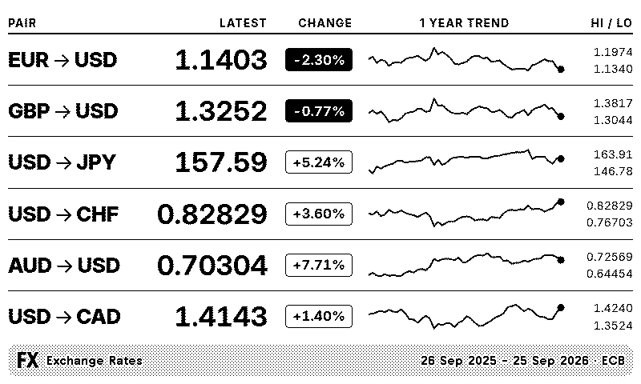
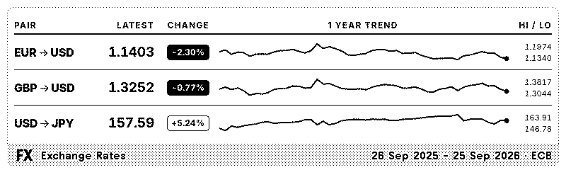
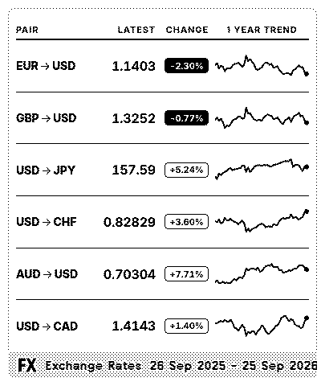
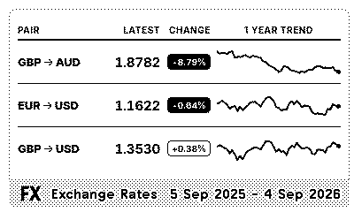

# FX Trends for TRMNL

Exchange rates as sparklines, for your [TRMNL](https://usetrmnl.com) e-ink
display.



## What it shows

One row per currency pair, up to eight (the full layout shows all eight on a
TRMNL X and the first six on the original TRMNL):

- **The pair**, written as a conversion: `GBP → AUD` means "one pound buys this
  many dollars".
- **The latest rate**, to five significant figures.
- **The percentage change** over your chosen window. Falls are filled black so
  the pairs that dropped stand out from across the room.
- **A sparkline** of the whole window, ending in a dot at the latest rate, with
  the window's high and low printed beside it.

You choose the pairs from 30 currencies, and a window of one month to five
years. The change, the sparkline and the high and low all follow that window.

The series is the European Central Bank's daily reference rates, via
[Frankfurter](https://frankfurter.dev), published once per working day. The
last point is the latest market rate, from [fxratesapi](https://fxratesapi.com),
refreshed hourly; the footer gives its date and time in UTC. If that source is
unavailable, the panel shows the last ECB fixing and its date alone, as it did
before. Installing the recipe needs no account or API key.

## Layouts

All four TRMNL layouts are supported, in landscape and portrait, on the
original TRMNL and the larger TRMNL X.

**Half horizontal**



**Half vertical**



**Quadrant**



## Install

### As a recipe

Installing from **Plugins → Recipes** in the TRMNL dashboard is the easiest
route and needs no setup. Pick your pairs and a window, and add it to a
playlist.

### As a private plugin

Use this if you want to run your own copy or tweak the templates. The plugin
polls a Cloudflare Worker that turns the ECB data into plot-ready rows; the
published Worker answers any TRMNL device, so you can keep using it and only
change the templates. Running your own Worker needs a free fxratesapi key for
the market rate, or it serves the ECB series alone; see the Worker README.

<details>
<summary>Using trmnlp (recommended)</summary>

1. Install [trmnlp](https://github.com/usetrmnl/trmnlp): `gem install trmnl_preview`.
2. Clone this repository and, in `trmnl-plugin/`, copy `.env.example` to
   `.env.mine`. Fill in your TRMNL API key (from **Account**) and set
   `WORKER_HOST` to the production host given in the file.
3. Run `./deploy.sh mine --create`. This creates the private plugin on your
   account and uploads the settings and all four layouts; the new plugin ID is
   written back into `.env.mine` for later pushes.
4. Add the plugin to a playlist.

</details>

<details>
<summary>Manually in the TRMNL dashboard</summary>

1. **Plugins → Private Plugin → New**. Set the strategy to **Polling** and the
   polling URL to the value of `polling_url` in `trmnl-plugin/src/settings.yml`.
2. In the form builder, paste the `custom_fields` block from the same file.
3. Open **Edit Markup** and paste each file from `trmnl-plugin/src/` into the
   matching tab: `full.liquid`, `half_horizontal.liquid`, `half_vertical.liquid`,
   `quadrant.liquid` and `shared.liquid`.
4. Save, then add the plugin to a playlist.

</details>

To run your own Worker as well, see the [Worker README](trmnl-worker/README.md)
and point `polling_url` at it.

## How it works

Two parts, deployed separately:

| Part | What it does |
|---|---|
| [`trmnl-worker/`](trmnl-worker/) | A Cloudflare Worker. One request to Frankfurter serves every pair; the Worker cross-rates, downsamples and returns plot-ready SVG coordinates, so the device does no arithmetic. |
| [`trmnl-plugin/`](trmnl-plugin/) | The TRMNL plugin: Liquid templates for all four layouts, the settings form, and a local preview and test setup. |

The Worker answers only TRMNL's own poller addresses, so it needs no token and
nothing secret ships in the recipe.

The panel is 1-bit e-paper, and most of the design follows from that: direction
is the sign on the figure rather than a colour, secondary information is smaller
rather than greyer, and each sparkline is scaled to its own range with the high
and low printed beside it so the shapes stay honest. The full list, with
reasons, is in the plugin README's
[design rules](trmnl-plugin/README.md#design-rules).

## Development

Each part has its own README with the details; the short version:

```bash
# Plugin: local preview at http://localhost:4567, and the render tests
cd trmnl-plugin && trmnlp serve
ruby test-render.rb

# Worker: local server, unit tests, and a live smoke test against Frankfurter
cd trmnl-worker && npm install && npm run dev
npm test
npm run smoke
```

- [Plugin README](trmnl-plugin/README.md) — preview, tests, design rules, deploy profiles
- [Worker README](trmnl-worker/README.md) — endpoint, tests, deploy, access control
- [`BUILD_PLAN.md`](BUILD_PLAN.md) — how the architecture was chosen
- [`docs/build_multi_deploy.md`](docs/build_multi_deploy.md) — how changes are
  staged on one device before they reach every installer
- [`docs/build_live_rates.md`](docs/build_live_rates.md) — how the latest market
  rate joins the daily ECB series

## Data source

| Data | Source | Terms |
|---|---|---|
| Daily exchange rates | [Frankfurter](https://frankfurter.dev), an open-source API serving the [ECB euro reference rates](https://www.ecb.europa.eu/stats/policy_and_exchange_rates/euro_reference_exchange_rates/html/index.en.html) | The ECB publishes the rates for information purposes only and discourages their use for transactions. Published around 16:00 CET on working days. |
| Latest market rate | [fxratesapi](https://fxratesapi.com), mid-market rates aggregated from many sources, hourly on the free plan | Its [licence](https://fxratesapi.com/legal/terms-conditions) permits display to an app's end users for their personal reference; attribution is appreciated, not required. Needs a free API key, which the Worker holds; installers need nothing. See [`docs/build_live_rates.md`](docs/build_live_rates.md). |

## Licence

[MIT](LICENSE).
